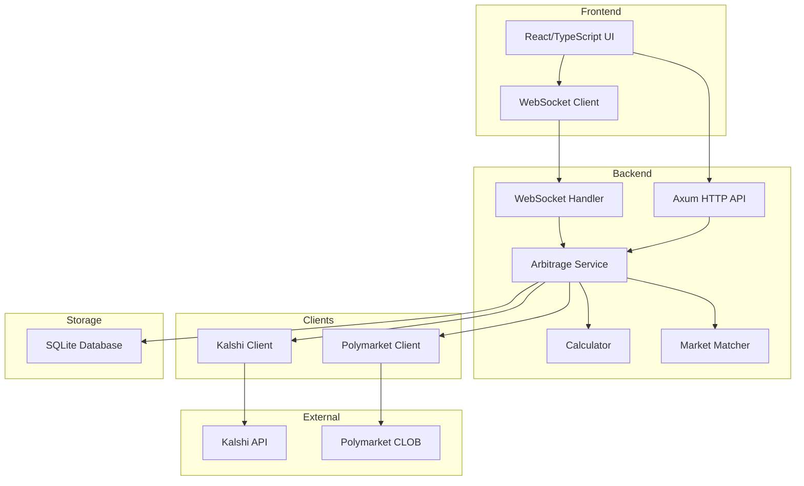
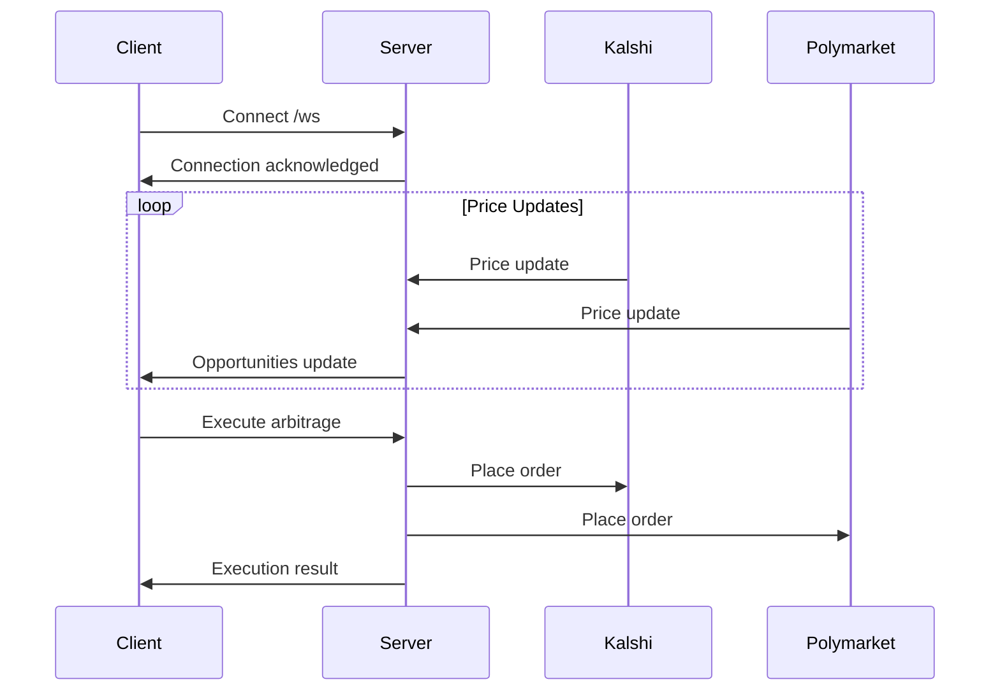
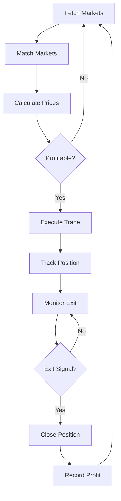

# Polkas

Prediction Market Arbitrage System - A high-performance arbitrage trading system for Kalshi and Polymarket prediction markets.

## Overview

Polkas monitors prices across Kalshi and Polymarket prediction markets, identifies arbitrage opportunities, and can automatically execute trades when profitable spreads are detected.

## Architecture



## Project Structure

```
polkas/
├── backend/                    # Rust backend
│   ├── src/
│   │   ├── api/               # HTTP/WebSocket API
│   │   │   ├── routes/        # API endpoints
│   │   │   ├── state.rs       # Application state
│   │   │   └── ws.rs          # WebSocket handler
│   │   ├── clients/           # Platform API clients
│   │   │   ├── kalshi.rs      # Kalshi REST/WebSocket
│   │   │   └── polymarket.rs  # Polymarket SDK integration
│   │   ├── domain/            # Domain models
│   │   ├── services/          # Business logic
│   │   │   ├── arbitrage.rs   # Arbitrage orchestrator
│   │   │   ├── calculator.rs  # Profit calculations
│   │   │   └── matcher.rs     # Market matching
│   │   ├── storage/           # SQLite persistence
│   │   ├── config/            # Configuration
│   │   └── utils/             # Utilities
│   ├── Cargo.toml
│   └── config.example.toml
│
├── frontend/                  # React/TypeScript frontend
│   ├── src/
│   │   ├── api/              # API client
│   │   ├── components/       # React components
│   │   ├── hooks/            # Custom hooks
│   │   ├── types/            # TypeScript types
│   │   └── utils/            # Utilities
│   ├── package.json
│   └── vite.config.ts
│
└── README.md
```

## Technology Stack

### Backend
- **Rust** - Systems programming language
- **Axum** - Web framework
- **Tokio** - Async runtime
- **rust_decimal** - Precise decimal arithmetic for financial calculations
- **polymarket-client-sdk** - Official Polymarket SDK
- **SQLite** - Local database for trade history and settings

### Frontend
- **React 18** - UI framework
- **TypeScript** - Type-safe JavaScript
- **Vite** - Build tool
- **Tailwind CSS** - Styling
- **Lucide React** - Icons

## Quick Start

### Prerequisites
- Rust 1.70+
- Node.js 18+
- npm or yarn

### Backend Setup

1. Copy the example config:
```bash
cp backend/config.example.toml backend/config.toml
```

2. Edit `config.toml` with your API credentials:
```toml
[kalshi]
api_key = "your-kalshi-api-key"
private_key_pem = "path/to/your/private-key.pem"

[polymarket]
private_key = "your-wallet-private-key"
```

3. Run the backend:
```bash
cd backend
cargo run --release
```

### Frontend Setup

1. Install dependencies:
```bash
cd frontend
npm install
```

2. Run development server:
```bash
npm run dev
```

3. Open http://localhost:5173

## API Endpoints

| Endpoint | Method | Description |
|----------|--------|-------------|
| `/api/health` | GET | Health check |
| `/api/opportunities` | GET | List arbitrage opportunities |
| `/api/markets` | GET | List matched markets |
| `/api/orders` | GET/POST | List/create orders |
| `/api/orders/:id` | DELETE | Cancel order |
| `/api/accounts/balance` | GET | Get account balances |
| `/api/accounts/positions` | GET | Get positions |
| `/api/history` | GET | Trade history |
| `/api/auto-trade` | GET/POST | Auto-trade settings |
| `/ws` | GET | WebSocket connection |

## WebSocket Messages



### Message Types

**Opportunities**
```json
{
  "type": "opportunities",
  "data": [...]
}
```

**Metrics**
```json
{
  "type": "metrics",
  "kalshi_balance": "1000.00",
  "poly_balance": "500.00",
  "total_trades": 42,
  "total_profit": "123.45"
}
```

## Arbitrage Strategy



### Profit Calculation

All calculations use `rust_decimal::Decimal` for precision:

```
Gross Profit = (Sell Price - Buy Price) * Position Size
Net Profit = Gross Profit - Fees
Profit Margin = (Net Profit / Position Size) * 100
```

## Configuration Reference

### Server
| Field | Type | Default | Description |
|-------|------|---------|-------------|
| host | string | 0.0.0.0 | Server bind address |
| port | number | 8080 | Server port |

### Kalshi
| Field | Type | Default | Description |
|-------|------|---------|-------------|
| api_url | string | https://api.kalshi.com | Kalshi API URL |
| ws_url | string | wss://api.kalshi.com | Kalshi WebSocket URL |
| api_key | string | - | Your API key |
| private_key_pem | string | - | RSA private key path |
| rate_limit_per_second | number | 10 | API rate limit |
| min_profit_threshold | decimal | 0.01 | Minimum profit (1%) |
| max_position_size | decimal | 10000 | Max position in USD |

### Polymarket
| Field | Type | Default | Description |
|-------|------|---------|-------------|
| api_url | string | https://clob.polymarket.com | CLOB API URL |
| ws_url | string | wss://ws-subscriptions-clob.polymarket.com | WebSocket URL |
| private_key | string | - | Wallet private key |
| chain_id | number | 137 | Polygon chain ID |
| gas_price_multiplier | decimal | 1.1 | Gas price multiplier |
| min_profit_threshold | decimal | 0.01 | Minimum profit (1%) |
| max_position_size | decimal | 10000 | Max position in USD |

### Arbitrage
| Field | Type | Default | Description |
|-------|------|---------|-------------|
| min_profit_threshold | decimal | 0.005 | Minimum profit (0.5%) |
| max_position_size | decimal | 5000 | Max position per trade |
| execution_timeout_ms | number | 5000 | Order timeout |
| retry_attempts | number | 3 | Retry count |
| retry_delay_ms | number | 100 | Retry delay |

### Database
| Field | Type | Default | Description |
|-------|------|---------|-------------|
| path | string | polkas.db | SQLite file path |
| pool_size | number | 5 | Connection pool size |

## Development

### Build Backend
```bash
cd backend
cargo build --release
```

### Build Frontend
```bash
cd frontend
npm run build
```

### Run Tests
```bash
cd backend
cargo test
```

## Security Notes

1. Never commit `config.toml` or private keys to version control
2. Use environment variables for sensitive data in production
3. The private key for Polymarket should be a dedicated trading wallet
4. Kalshi requires RSA key authentication - keep your private key secure

## License

MIT
